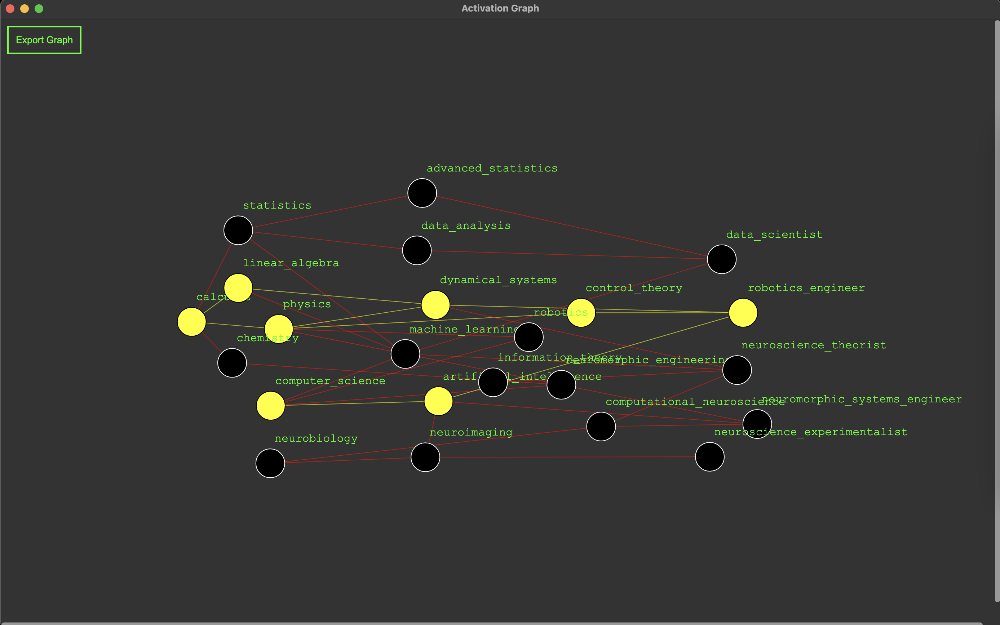
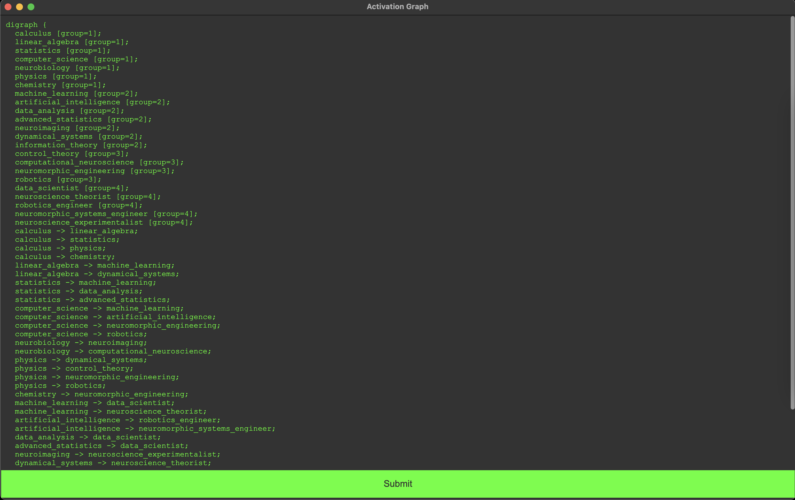
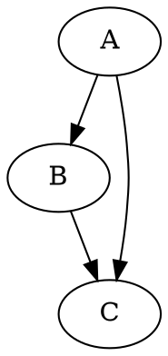
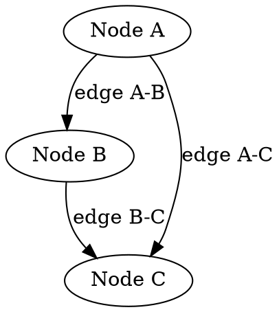

Here's a draft for your README.md file:

---

# Activation Graph



**Activation Graph** is an intuitive tool designed to provide an easy visualization of all upstream nodes of any downstream node at a glance by dynamically highlighting them.

The tool also provides an editor where you can build your graph using the graphviz DOT language and then export it as an SVG file for further use.

## Getting Started

Start by cloning the repository to your local machine:

```bash
git clone https://github.com/yourusername/ActivationGraph.git
```

To install dependencies, navigate to the directory where you cloned the repo and run:

```bash
npm install
```

Once the dependencies are installed, you can run the application with:

```bash
npm start
```

## Editor

In the editor, you can create your graph using the DOT language. It provides syntax highlighting and error checking to make your job easier.



### Graphviz DOT Language

Graphviz's DOT language is a simple way to describe graphs. Here's an example of a simple graph in DOT language:



In this script, `A`, `B` and `C` are nodes. The `->` syntax defines a directed edge, so `A -> B;` indicates a connection from node `A` to node `B`.

Nodes can have labels and edges can have labels, too. For instance:



You can also set global attributes or individual ones to change the graph, nodes, edges, and labels appearance.

## Exporting Graph as SVG

Once your graph is ready, you can export it as an SVG file using the 'Export Graph' button located at the top left corner of the window. This provides a scalable and editable image that can be used in a variety of applications.

## Contact

If you encounter any issues or have suggestions for improvements, feel free to open an issue or submit a pull request.